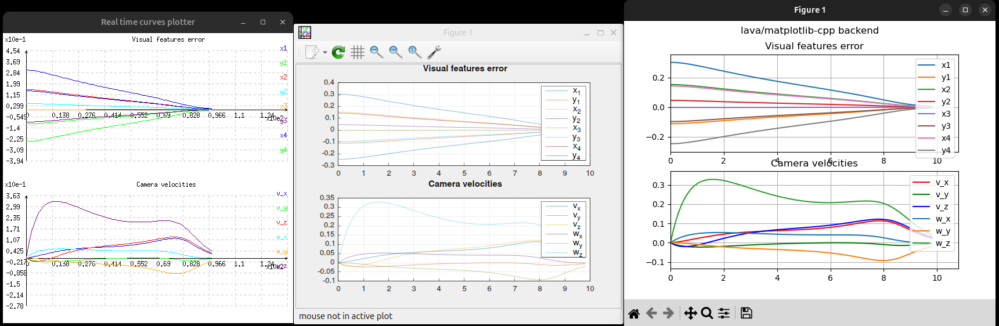
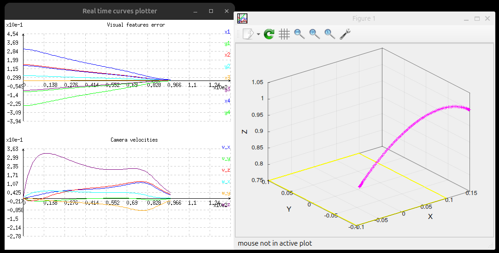
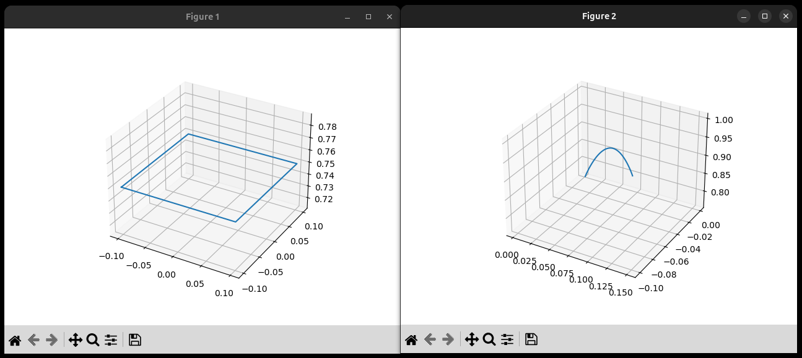

# Experimentations about two C++ matplot plotting libs

## alandefreitas/matplotplusplus
- gnuplot wrapper
- `https://github.com/alandefreitas/matplotplusplus`
- needs at least `libgnuplot-iostream-dev` apt install
- `cmake .. -DCMAKE_BUILD_TYPE=Release -DCMAKE_INSTALL_PREFIX=$(pwd)/install -DMATPLOTPP_BUILD_EXAMPLES=OFF -DMATPLOTPP_BUILD_TESTS=OFF -DMATPLOTPP_BUILD_WITH_PEDANTIC_=OFF`
- [documentation / examples code](https://alandefreitas.github.io/matplotplusplus/)
- seems like cannot use OpenCV with CImg: https://github.com/alandefreitas/matplotplusplus/issues/422

## lava/matplotlib-cpp
- Matplotlib wrapper
- needs too much fixes, see the commits in the corresponding folder:
  - [Fix: subplot()'s arguments should be ints, not doubles #290](https://github.com/lava/matplotlib-cpp/pull/290/files)
  - [Some examples dont work (segfault and std::runtime_error) #316](https://github.com/lava/matplotlib-cpp/issues/316)
  - [fix: update api to support matplotlib-3.7.1 version #352](https://github.com/lava/matplotlib-cpp/pull/352)
  - [why does matplotlib-cpp throw runtime exceptions in the 3d examples](https://stackoverflow.com/questions/76077363/why-does-matplotlib-cpp-throw-runtime-exceptions-in-the-3d-examples)
- `cmake .. -DCMAKE_BUILD_TYPE=Release -DCMAKE_INSTALL_PREFIX=$(pwd)/install`
- [examples code](https://github.com/lava/matplotlib-cpp/tree/master/examples)

## src/ibvs-4pts-plotter-continuous-gain-adaptive-plot2d.cpp

### alandefreitas/matplotplusplus
- flickering issue:
  - [Figure full refreshes on changing anything? #143](https://github.com/alandefreitas/matplotplusplus/discussions/143)
  - [The window blinks a lot before the plot is shown #223](https://github.com/alandefreitas/matplotplusplus/discussions/223)

### lava/matplotlib-cpp
- OK

### Screenshot

## src/ibvs-4pts-plotter-continuous-gain-adaptive-plot3d.cpp

### alandefreitas/matplotplusplus
- flickering issue

### lava/matplotlib-cpp
- cannot do real-time plotting
- cannot do multiple plots on the same 3d canvas

### Screenshots

